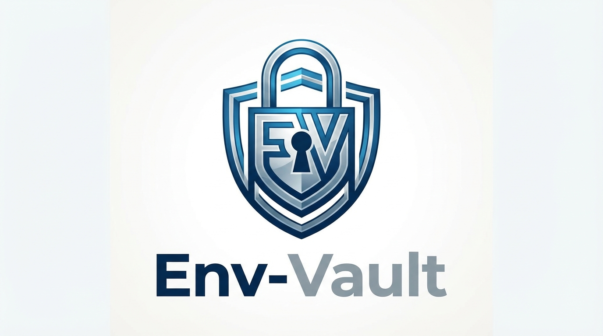

<p align="center">
  
</p>

<h1 align="center">🔐 env-vault</h1>

<p align="center">
  <strong>Secure .env file encryption for team collaboration.</strong><br />
  AES-256-GCM · Zero config · Works with npx
</p>

<p align="center">
  <a href="https://www.npmjs.com/package/env-vault"></a>
  <a href="https://www.npmjs.com/package/env-vault"></a>
  <a href="https://github.com/ouchanip/env-vault-node/blob/main/LICENSE"></a>
</p>

---

## The Problem

Every dev team has `.env` files with API keys, database passwords, and tokens. You can't commit them to Git, so you end up sharing them over Slack, email, or sticky notes.

**That's a security nightmare.**

## The Solution

`env-vault` encrypts your `.env` into `.env.enc` — a file you **can** safely commit to Git. Only team members with the key can decrypt it.

<p align="center">
  
</p>

## Quick Start

```bash
# 1. Generate encryption key
npx env-vault init

# 2. Encrypt .env → .env.enc (safe to commit)
npx env-vault encrypt

# 3. Decrypt .env.enc → .env (restore secrets)
npx env-vault decrypt -o .env
```

**That's it. Three commands. Zero config.**

## Installation

```bash
# Run directly (no install)
npx env-vault <command>

# Or install globally
npm install -g env-vault

# Or as a dev dependency
npm install --save-dev env-vault
```

## Commands

| Command   | Description                          |
|-----------|--------------------------------------|
| `init`    | Generate a new `.env.key` encryption key |
| `encrypt` | Encrypt `.env` → `.env.enc`          |
| `decrypt` | Decrypt `.env.enc` → stdout or file  |

### Options

```
encrypt:
  -i, --input-file <path>   Input file (default: .env)
  -o, --output-file <path>  Output file (default: .env.enc)

decrypt:
  -i, --input-file <path>   Input file (default: .env.enc)
  -o, --output-file <path>  Output file (default: stdout)
```

## Workflow

```
Developer A                    Git Repo                    Developer B
┌──────────┐                 ┌──────────┐                 ┌──────────┐
│  .env     │── encrypt ──▶  │ .env.enc │  ◀── pull ──   │          │
│  .env.key │                │          │                 │ .env.key │
└──────────┘                 └──────────┘                 └──────────┘
                                                           decrypt ──▶ .env
```

1. **Developer A** runs `env-vault encrypt` and commits `.env.enc`
2. **Developer B** pulls and runs `env-vault decrypt -o .env`
3. Share `.env.key` once (securely), commit `.env.enc` as often as you like

## .gitignore Setup

```gitignore
# Secrets — NEVER commit these
.env
.env.key
.env.*.key

# Safe to commit
.env.enc
```

## Security

| Property    | Value                                   |
|-------------|-----------------------------------------|
| Algorithm   | AES-256-GCM (authenticated encryption)  |
| Key size    | 256 bits (32 bytes, hex-encoded)        |
| IV          | 96 bits (12 bytes), random per encryption |
| Auth Tag    | 128 bits (16 bytes)                     |
| Dependencies| Node.js built-in `crypto` only          |

Every encryption generates a fresh random IV. The auth tag ensures integrity — any tampering is detected.

## Testing

```bash
npm test
```

15 tests across 3 suites covering encryption, decryption, key generation, error handling, and edge cases.

## Contributing

Issues and PRs are welcome! Please open an issue first to discuss major changes.

## License

[MIT](LICENSE)
